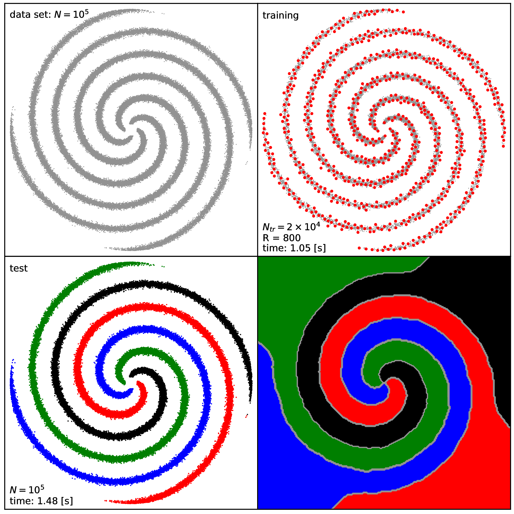

----

# The `leuven` library and framework

Framework, toolkit and **ready-to-use applications** for numerical linear algebra dependent machine learning algorithms. 

List of applications: 

 - fast, **sparse Kernel Spectral Clustering (KSC)**, for large scale data analysis, **formulated as Weighted Kernel PCA within the LS-SVM framework**. The sparsity is achived by the combination of the **incomplete Cholesky factorisation** based low rank approximation **of the kernel matrix** with the so called **reduced set method**. See more on the theoretical backround in the [corresponding technical report](https://www.esat.kuleuven.be/stadius/ADB/novak/kscicd_internal.pdf) or on the application itself in [the dedicatet KSC application documentation and user guide](https://leuven-ksc.readthedocs.io/en/latest/).

## Short description

The `leuven` library provides a very simple **framework for facilitating the `C/C++` implementation of** machine learning, optimisation related and other **algorithms, that relies heavily on manipulating** (multi dimensional) **data by** using **linear algebra**:

 - a very **lightweight matrix** for representing array like (e.g. vector, matrix) with **generic data types** supporting **both row- and column-major memory layouts** (see more at the [On the lightweight matrix implementation](https://leuven.readthedocs.io/en/latest/main/introduction.html#on-the-lightweight-matrix-implementation) section of the [Documentation](https://leuven.readthedocs.io/en/latest/))
 - interfaces for **CPU BLAS/LAPACK** implementation routines to manipulate the underlying data (see more at the [On the BLAS/LAPACK support](https://leuven.readthedocs.io/en/latest/main/introduction.html#on-the-blas-lapack-support) of the [Documentation](https://leuven.readthedocs.io/en/latest/))
 - same interfaces for **GPU (CUDA) BLAS/LAPACK** implementations as options (see more at the [On the CUDA support](https://leuven.readthedocs.io/en/latest/main/introduction.html#on-the-cuda-support) section of the [Documentation](https://leuven.readthedocs.io/en/latest/))  
 
 
 The library also servers **as a toolkit**, since already **contains the implementation of the components of some machine learning algorithms**. While these components can be utilised by the users to create their own applications, **ready-to-use, complete machine learning applications are also provided** by the developers as example applications of the toolkit. **Each** of these **example applications** has their own documentation and **can be built and used individually after the installation of the `leuven` library and framework**. See the **sparse Kernel Spectral Clustering (KSC)** applications as a quick example [below](example-application:-sparse-Kernel-Spectral-Clustering-on-large-scale-data) or [the complete KSC application documentation](https://leuven-ksc.readthedocs.io/en/latest/) for all details.

 See more details in the [Documentation](https://leuven.readthedocs.io/en/latest/).

## Requirements

Building the `leuven` library requires:

 - a `c/c++` compiler, with `c++11` support e.g. `GCC >= 4.9` or `clang >= 3.1`, to be installed on the system (even a `Fortran` compiler might be needed when other than `Intel MKL` is used as CPU BLAS/LAPACK option)
 - `CMake` to be installed on the system. `CMake` is used for managing (option configuration, locate dependencies etc.) the build process (see at http://www.cmake.org/).
 - the `leuven` library heavily relies on BLAS/LAPACK functionalities so `BLAS` and `LAPACK libraries` must to be installed on the system. It is **strongly recommended to use** one of the freely available, **optimised implementations such as** the **`Intel MKL`, `OpenBLAS`** or **`ATLAS`** (see more at the [Build and install](https://leuven.readthedocs.io/en/latest/main/install.html) section of the [Documentation](https://leuven.readthedocs.io/en/latest/)).

## Quick (and dirty) start

> :warning: **Warning!** While the following might work well, it gives very little or no control on what BLAS/LAPACK implementation is pick up and will be used by the `leuven` library. Since the performance (as well as the provided flexibility) of the library, strongly depends on the available and selected BLAS/LAPACK options, it is **strongly recommended to install and specify explicitly** the BLAS/LAPACK implementation related configurations as shown in the [BLAS/LAPACK options](https://leuven.readthedocs.io/en/latest/main/install.html#blas-lapack-options) section of the [Build and install](https://leuven.readthedocs.io/en/latest/main/install.html#) of the [Documentation](https://leuven.readthedocs.io/en/latest/).

    bash-3.2$ git clone https://github.com/mnovak42/leuven.git
    bash-3.2$ cd leuven
    bash-3.2$ mkdir build
    bash-3.2$ cd build/
    bash-3.2$ cmake -DCMAKE_INSTALL_PREFIX=/where/to/install ../
    bash-3.2$ make -j4
    bash-3.2$ make install

  
Click to expand for some details!

When BLAS/LAPACK libraries are installed at one of the standard location of the system (e.g. `/usr/local/lib64, /usr/local/lib, /usr/lib64, /usr/lib, etc.`, one can skip the explicit specification of the required BLAS/LAPACK implementation during the `cmake` configuration of the `leuven` library since the required libraries will be searched under these standard locations automatically in this case. So after cloning  

    bash-3.2$ git clone https://github.com/mnovak42/leuven.git
    Cloning into 'leuven'...
    remote: Enumerating objects: 300, done.
    remote: Counting objects: 100% (300/300), done.
    remote: Compressing objects: 100% (239/239), done.
    remote: Total 300 (delta 60), reused 282 (delta 52), pack-reused 0
    Receiving objects: 100% (300/300), 46.29 MiB | 10.64 MiB/s, done.
    Resolving deltas: 100% (60/60), done.

and entering to the main `leuven` directory 

    bash-3.2$ cd leuven

one can perform the following steps to install the library:

1. Create a `build` directory where all the configuration and build related objects, files will be placed
  
       bash-3.2$ mkdir build

2. Change to the previously created build directory and generate the make files with the given configurations (`-DCMAKE_INSTALL_PREFIX` `cmake` configuration option specifies the location where the final product will be installed e.g. my `/Users/mnovak/opt/leuven1` directory in this case)

       bash-3.2$ cd build/
       bash-3.2$ cmake -DCMAKE_INSTALL_PREFIX=/Users/mnovak/opt/leuven1 ../
       -- The C compiler identification is AppleClang 10.0.0.10001145
       -- The CXX compiler identification is AppleClang 10.0.0.10001145
       -- Check for working C compiler: /Applications/Xcode.app/Contents/Developer/Toolchains/XcodeDefault.xctoolchain/usr/bin/cc
       -- Check for working C compiler: /Applications/Xcode.app/Contents/Developer/Toolchains/XcodeDefault.xctoolchain/usr/bin/cc -- works
       -- Detecting C compiler ABI info
       -- Detecting C compiler ABI info - done
       -- Detecting C compile features
       -- Detecting C compile features - done
       -- Check for working CXX compiler: /Applications/Xcode.app/Contents/Developer/Toolchains/XcodeDefault.xctoolchain/usr/bin/c++
       -- Check for working CXX compiler: /Applications/Xcode.app/Contents/Developer/Toolchains/XcodeDefault.xctoolchain/usr/bin/c++ -- works
       -- Detecting CXX compiler ABI info
       -- Detecting CXX compiler ABI info - done
       -- Detecting CXX compile features
       -- Detecting CXX compile features - done
       -- ===== WRAPPER ===== 
       -- Building with the FBLAS Wrapper

       -- ==== The selected CPU BLAS Option = NETLIB-BLAS  ==== 
       --  
       -- ========  NETLIB BLAS (or any BLAS) ======= 
       --  WAS FOUND = TRUE
       -- NETLIB BLAS LIBRARY = /usr/lib/libblas.dylib;/usr/lib/liblapack.dylib
       --  
       -- ===== CHECKING CPU BLAS WRAPPER AND LIBRARY CONSISTENCY =====
       --  
       -- ===== Setting up the leuven library =====

       -- ===== Adding the lssvm part ===== 

       -- Configuring done
       -- Generating done
    
3. Build the `leuven` library 

       bash-3.2$ make 
       Scanning dependencies of target leuven
       [ 50%] Building CXX object utils/CMakeFiles/leuven.dir/src/FBLAS.cc.o
       [100%] Linking CXX static library ../lib/libleuven.a
       [100%] Built target leuven

4. and install, together with the headers and configurations files, to the location specified by the `-DCMAKE_INSTALL_PREFIX` `cmake` configuration option.  

       bash-3.2$ make install
       [100%] Built target leuven
       Install the project...
       -- Install configuration: "Release"
       -- Installing: /Users/mnovak/opt/leuven1/includes/Matrix.hh
       -- Installing: /Users/mnovak/opt/leuven1/includes/cxxopts.hh
       -- Installing: /Users/mnovak/opt/leuven1/includes/definitions.hh
       -- Installing: /Users/mnovak/opt/leuven1/includes/types.hh
       -- Installing: /Users/mnovak/opt/leuven1/includes/FBLAS.hh
       -- Installing: /Users/mnovak/opt/leuven1/includes/XBLAS.tpp
       -- Installing: /Users/mnovak/opt/leuven1/includes/FBLAS.h
       -- Installing: /Users/mnovak/opt/leuven1/includes/FBLAS.tpp
       -- Up-to-date: /Users/mnovak/opt/leuven1/includes/definitions.hh
       -- Installing: /Users/mnovak/opt/leuven1/lib/libleuven.a
       -- Installing: /Users/mnovak/opt/leuven1/lib/cmake/leuven/leuvenConfig.cmake
       -- Installing: /Users/mnovak/opt/leuven1/includes/IncCholesky.hh
       -- Installing: /Users/mnovak/opt/leuven1/includes/Kernels.hh
       -- Installing: /Users/mnovak/opt/leuven1/includes/IncCholesky.tpp
       -- Installing: /Users/mnovak/opt/leuven1/includes/KernelChi2.tpp
       -- Installing: /Users/mnovak/opt/leuven1/includes/KernelRBF.tpp
       -- Installing: /Users/mnovak/opt/leuven1/includes/KernelSSK.tpp
       -- Installing: /Users/mnovak/opt/leuven1/includes/KscEncodingAndQM.hh
       -- Installing: /Users/mnovak/opt/leuven1/includes/KscEncodingAndQM_AMS.hh
       -- Installing: /Users/mnovak/opt/leuven1/includes/KscEncodingAndQM_BAS.hh
       -- Installing: /Users/mnovak/opt/leuven1/includes/KscEncodingAndQM_BLF.hh
       -- Installing: /Users/mnovak/opt/leuven1/includes/KscWkpcaIChol.hh
       -- Installing: /Users/mnovak/opt/leuven1/includes/KscWkpcaIChol.tpp

## Example application: sparse Kernel Spectral Clustering on large scale data 

**The `leuven` library** and toolkit **provides** the implementation of the **ingredients of a sparse Kernel Spectral Clustering (KSC) model** suitable for clustering large data sets. (The sparsity is achieved by the combination of the reduced-set method with the **incomplete Cholesky factorisation** based approximation **of the kernel matrix**.)

**The `leuven` library** already **contains ready-to-use applications** for performing *hyper-parameter tuning*, *training* and *out-of-sample extension* of such a **sparse KSC** model. The codes, related to these example applications, are located under the `apps/examples/KSC` directory. The applications can be built **after the installation of the `leuven` library**

    bash-3.2$ cd apps/examples/KSC/
    bash-3.2$ mkdir build
    bash-3.2$ cd build/
    bash-3.2$ cmake ../ -Dleuven_DIR=/where/leuven/is/installed/lib/cmake/leuven -DCMAKE_INSTALL_PREFIX=/where/to/install/
    bash-3.2$ make
    bash-3.2$ make install

Note, that the location of the previously installed `leuven` library (actually, the location of its `leuvenConfig.cmake` `CMake` configuration file) needs to be given to `CMake` in the `-Dleuven_DIR` configuration variable. The additional `CMake` configuration variable `-DCMAKE_INSTALL_PREFIX` can be used to set the location where the applications will be installed.

After installing the **KSC applications** they are ready to solve clustering problems. Several tests/examples are provided for demonstrating the usage of the applications and to provide a bit deeper insight into the key points. See all the details in [the complete KSC application documentation](https://leuven-ksc.readthedocs.io/en/latest/).

One of the results, generated by executing the provided `tests/test3` example
(locating under the installation directory specified above), is shown below.

 

> :grey_exclamation: **Note**: each of the sub-directories of the `apps/examples/` directory contains a set of applications related to a common problem such as the above `KSC`. Each of these sub-directories (similarly to the above `apps/examples/KSC`), **can be** freely **copied**, the corresponding example applications can be **built and used individually after the `leuven` library has already been installed** on the system. 
