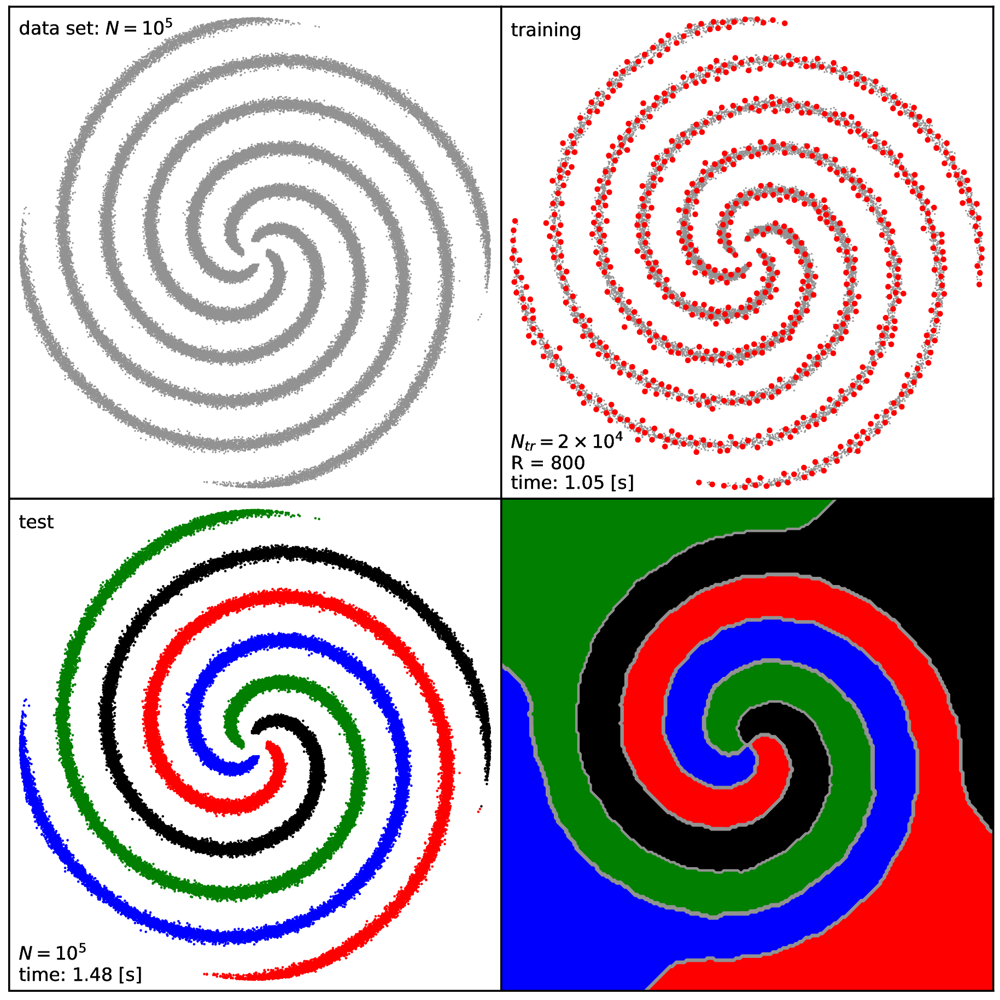

Sparse Kernel Spectral Clustering Applications - documentation and user guide
==============================================================================

This is the documentation and user guide for the **sparse Kernel Spectral Clustering (KSC)**
**applications for large scale data**, provided by the :math:`leuven` library/framework and its developers
as ready-to-use example applications for the KSC part of the framework. See more 
on the :math:`leuven` library and framework at 
`its git repository <https://github.com/mnovak42/leuven>`_ or in 
`its documentation <https://leuven.readthedocs.io/en/latest/>`_. 

   Illustration: clustering result obtained by using the  
   **sparse Kernel Spectral Clustering Applications**. See more at the 
   :ref:`Test1 <sec_test1>` Section. 

.. toctree::
   :maxdepth: 2
   :caption: Contents 
   
   main/introduction
   main/install
   main/applications
   tests/theTests

   zzbib 
      
   
Indices and tables
==================

* :ref:`genindex`
* :ref:`modindex`
* :ref:`search`
