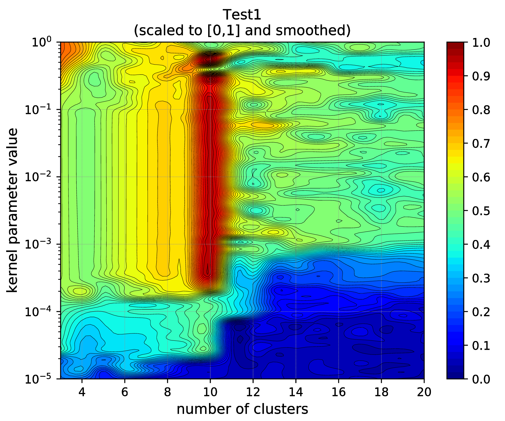
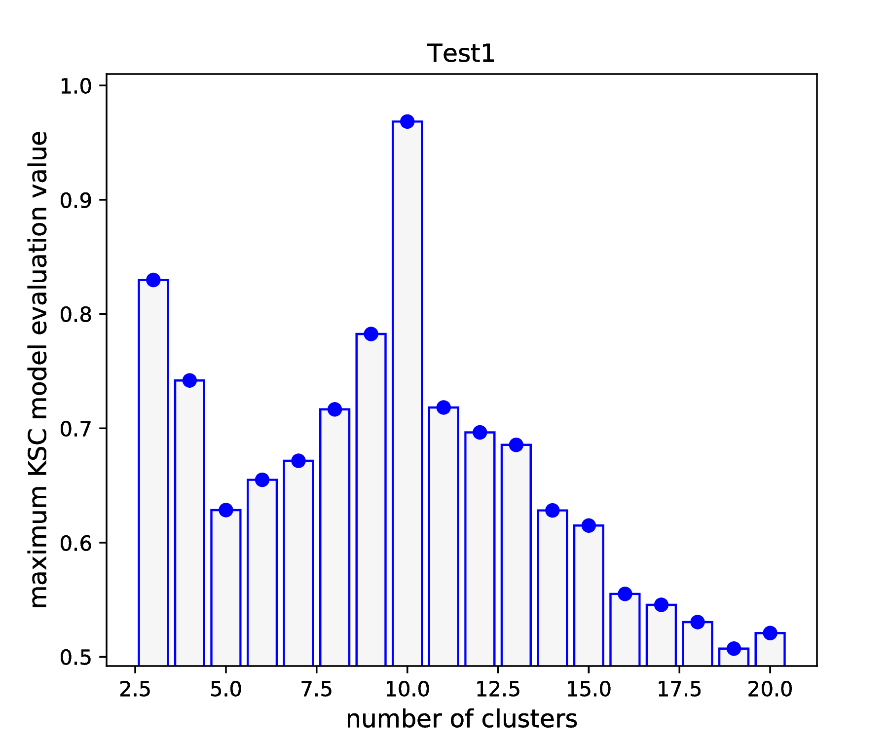
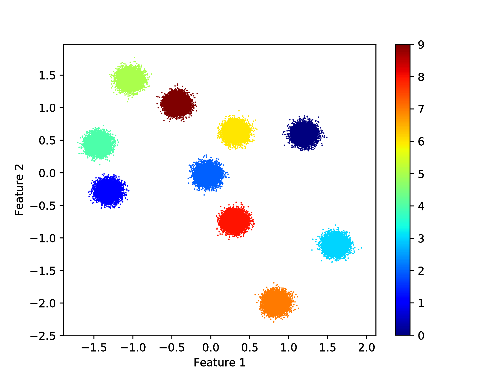

.. _sec_test1:

Test1
======

This clustering problem was prepared for testing if the applications are 
installed properly and everything works as expected. While the clustering 
problem is simple, it gives the possibility to demonstrate the usage of the 
provided applications and the auxiliary scripts.

Description of the problem
---------------------------

This problem contains pre-generated data set with :math:`N= 100 000` samples 
from :math:`K=10` clusters in :math:`d=2` dimensional feature space. The 
clusters are linearly separable in the input space and the individual cluster 
points has Gaussian distributions around their cluster centers with the same 
standard deviation.

The test
--------

After the installation of the KSC applications, the :math:`\texttt{tests/Test1}` 
directory, under the directory specified for installation, should contain the 
components listed in :numref:`table1_test1`.

.. _table1_test1: 

.. table:: Content of the :math:`\texttt{tests/Test1}` directory.
    :widths: 20 50
    
    ======================= =============
     File name                Description
    ======================= =============
     data.tar.gz              The pre-generated data.
     runKSCIchol_Tune.sh      Shell script for executing the hyper parameter 
                              tuning KSC application. The script contains the,
                              input parameter values that are appropriate for 
                              the given data set.
     runKSCIchol_Test.sh      Same as above for out-of-sample-extension i.e. for 
                              executing the testing KSC application.
     runKSCIchol_Train.sh     Same as above for training.
    ======================= =============  
    

In the following, a step by step demonstration shows how to use these scripts.

First one needs to extract the compress data directory as ::

  bash-3.2$ tar -zxvf data.tar.gz 
  x data/
  x data/data_Train_N10000.dat
  x data/data.dat
  x data/data_Labels.dat
  x data/data_Valid_N10000.dat

As it can be seen, the pre-generated data set contains 

.. _table1_test2: 

.. table:: The pre-generated data set under the :math:`\texttt{data}` directory.
    :widths: 20 50
    
    ======================= ====================================================
     File name                Description
    ======================= ====================================================
     data.dat                 The pre-generated data.
     data_Labels.dat          The corresponding *true cluster labels*.
     data_Train_N10000.dat    Sub-sample for *training*.
     data_Valid_N10000.dat    Sub-sample for *validation*.
    ======================= ==================================================== 

As listed in :numref:`table1_test2`, the :math:`\texttt{data.dat}` file contains
the whole data set: 
:math:`N = 10 000, d = 2`, dimensional samples generated from :math:`K = 10` 
(linearly) well separated clusters. Note, that the data are standardised! 
The :math:`\texttt{data}\_\texttt{Labels.dat}` file contains the corresponding 
*true cluster labels* while :math:`\texttt{data}\_\texttt{Train}\_\texttt{N10000.dat}` and  
:math:`\texttt{data}\_\texttt{Valid}\_\texttt{N10000.dat}` contains :math:`10 000` for 
sub-sampled for *training* and *validation* respectively. 

Since the KSC applications generates output data and their location is set to 
an :math:`\texttt{out}` directory located in the current directory, one needs to 
make sure that this directory exists as ::

  bash-3.2$ mkdir out       
  
Before executing the provided shell script, one needs to make sure, that they 
are executable. This can be done by ::

  bash-3.2$ chmod +x *.sh

Hyper parameter tuning
-----------------------

At this point, one could start to explore the data using the KSC application for 
training with the given :math:`\texttt{runKSCIchol}\_\texttt{Train.sh}` script to 
try to find suitable range for the input parameter values such as the parameters 
for the incomplete Cholesky decomposition or the range of cluster number and 
kernel parameter values. 

This has already been done, and the proper parameter values for the incomplete 
Cholesky decomposition as well as for the hyper parameter tuning are already set 
in the :math:`\texttt{runKSCIchol}\_\texttt{Tune.sh}` application. Note, that 
the goal of the hyper parameter tuning is to find the number of clusters and 
kernel parameter value combination that maximises the KSC model selection 
criterion. 

One can then execute the hyper parameter tuning KSC application with the provided 
script as ::

  bash-3.2$ ./runKSCIchol_Tune.sh 

   ===============================================================

   Ksc Tuning Input Parameters (with defaults for optionals):

    ------ Cholesky decomposition related: 
    icholTolError              = 0.85
    icholMaxRank               = 500
    icholRBFKernelPar          = 0.002
    ------ Training data set related: 
    trDataNumber               = 10000
    trDataDimension            = 2
    trDataFile                 = data/data_Train_N10000.dat

    ------ Validation data set related: 
    valDataNumber              = 10000
    valDataFile                = data/data_Valid_N10000.dat

    ------ Tuning related: 
    minClusterNumber           = 3
    maxClusterNumber           = 20
    kernelPrameters            = {1e-05, 1.2649e-05, ..., 1}  --> 50 number of parameters. 

    ------ Clustering related: 
    clEncodingScheme(BAS=2)    = 1
    clEvalOutlierThrs(0)       = 100
    clEvalWBalance(0.2)        = 0.5

    ------ Other, optional parameters: 
    verbosityLevel(2)          = 2
    numBLASThreads(4)          = 4
    resFile(TuningRes)         = out/TuningRes

   ===============================================================

   ---- Starts: allocating memory for and loading the training data.
   ---- Finished: allocating memory for and loading the training data:
        ---> Dimensions of M  :(10000 x 2)

   ---- Starts: incomplete Cholesky decomposition of the Kernel matrix.
   ---- Finished: incomplete Cholesky decomposition of the Kernel matrix
        ---> Duration of ICD  : 0.13638 [s]
        ---> Final error      : 0.847978
        ---> Rank of the aprx : 110
        ---> Dimensions of G  :(10000 x 110)

   ---- Starts: allocating memory for and loading the validation data.
   ---- Finished: allocating memory for and loading the validation data:
        ---> Dimensions of M  :(10000 x 2)

   ---- Starts: tuning the KSC model.
     ---> Using Open BLAS on 4 threads.
    === KscWkpcaIChol::Tune : tuning for the 0-th kernel paraeters out of the 49
    === KscWkpcaIChol::Tune : tuning for the 1-th kernel paraeters out of the 49
    === KscWkpcaIChol::Tune : tuning for the 2-th kernel paraeters out of the 49
    .
    .
    .
    === KscWkpcaIChol::Tune : tuning for the 48-th kernel paraeters out of the 49
    === KscWkpcaIChol::Tune : tuning for the 49-th kernel paraeters out of the 49
   ---- Finished: training the KSC model
        ---> Duration         :   4.43864 [s]
        ---> The encoding(QM) :   AMS
        --->   Eta balance    :   0.5
        --->   Outlier thres. :   100
        --->   Optimality     :   
               - QM value          : 0.968416
               - number of clusters: 10
               - kernel par. indx. : 20 ( = 0.0010985 )
        ---> Result is written: out/TuningRes

As it can be seen, that the application will report the input parameter values 
and settings, then starts the tuning. The script contains the following setting 
of the 2D cluster number and kernel values grid: 

 - cluster numbers from 2 till 20 
 - kernel parameter values: 50 values between 1.0e-05 and 1.0 in log-spaced grid
 
The incomplete Cholesky decomposition of the training data kernel matrix results
in an approximation with a rank of 110 and the exploration of the KSC models 
over the 2D hyper parameter grid starts: a sparse KSC model is trained at each 
grid point using the training data set and evaluated on the validation set.

At the end a summary report is given, that shows the hyper parameter values 
of the 2D grid (cluster number of 10 and RBF kernel parameter of 0.001) that 
yields the highest KSC model evaluation criterion value (of 0.968) on the 
validation set.

The application reports the complete evaluation of the KSC models over the 2D 
grid by writing them into the files :math:`\texttt{out/TuningRes}` (as this 
was set in the script). A :math:`\texttt{python}` script is provided under the 
:math:`\texttt{../utils}` directory to visualise and inspect this complete 
results of the KSC tuning application and can be utilised as ::

  python ../utils/plotResTuning.py -f out/TuningRes

First, this will show a 2D (scaled) image plot of the result of the tuning over 
the 2D hyper parameter grid first. Then a second plot, a projection of the 
previous 2D plot to the cluster number scale, is shown (see more 
documentation of the :ref:`plotResTuning <plotResTuning_doc>` script). The 
resulted figures are shown in :numref:`test1_fig1_a` and :numref:`test1_fig1_b`.

   Results of the KSC hyper parameter tuning application (2D image as visualised      
   by using the :ref:`plotResTuning <plotResTuning_doc>` script). 
             

   Results of the KSC hyper parameter tuning application (1D projection as visualised      
   by using the :ref:`plotResTuning <plotResTuning_doc>` script).            

According to the results shown in :numref:`test1_fig1_a` and :numref:`test1_fig1_a`,
there is a clear maximum of the KSC model selection criterion (AMS) value at 
cluster number 10. Moreover, according to the results shown in :numref:`test1_fig1_a`, 
this maximum value can be achieved with a wide range (:math:`\sim 2\times 10^{-4} - 2\times 10^{-1}`) 
of RBF kernel parameter value. These results confirm the optimality point 
reported at the end of the KSC tuning application: 
optimal number of cluster is 10 and optimal RBF kernel parameter value is 0.001.

Out-of-sample extension i.e. **testing**
-----------------------------------------

After determining the optimal values of all the necessary input parameters, one 
can train the sparse KSC model on the training set and apply the trained model 
to cluster any further, unseen data. This can be done by using the KSC application 
developed for testing. The  :math:`\texttt{runKSCIchol}\_\texttt{Test.sh}` script, 
already contains the appropriate values of all the input parameters of this 
application, including the optimal cluster number and RBF kernel parameter 
values, determined above during the hyper parameter tuning. Therefore, one can 
execute the application by ::

  bash-3.2$ ./runKSCIchol_Test.sh 

   ===============================================================

   Ksc Training & Testing Input Parameters (with defaults for optionals):

    ------ Cholesky decomposition related: 
    icholTolError              = 0.85
    icholMaxRank               = 500
    icholRBFKernelPar          = 0.002

    ------ Training data set related: 
    trDataNumber               = 10000
    trDataDimension            = 2
    trDataFile                 = data/data_Train_N10000.dat

    ------ Test data set related: 
    tstDataNumber              = 100000
    tstDataFile                = data/data.dat

    ------ Clustering related: 
    clNumber                   = 10
    clRBFKernelPar             = 0.001
    clEncodingScheme(BAS=2)    = 1
    clEvalOutlierThrs(0)       = 100
    clEvalWBalance(0.2)        = 0.5
    clResFile(CRes.dat)        = out/CRes.dat
    clLevel(1)                 = 1

    ------ Other, optional parameters: 
    verbosityLevel(2)          = 2
    numBLASThreads(4)          = 4

   ===============================================================

   ---- Starts: allocating memory for and loading the training data.
   ---- Finished: allocating memory for and loading the training data:
        ---> Dimensions of M  :(10000 x 2)

   ---- Starts: incomplete Cholesky decomposition of the Kernel matrix.
   ---- Finished: incomplete Cholesky decomposition of the Kernel matrix
        ---> Duration of ICD  : 0.136879 [s]
        ---> Final error      : 0.847978
        ---> Rank of the aprx : 110
        ---> Dimensions of G  :(10000 x 110)

   ---- Starts: training the KSC model.
     ---> Using Open BLAS on 4 threads.
            ====> Starts computing eigenvectors... 
     ---> Using Open BLAS on 4 threads.
            ====> Starts forming the Reduced-Reduced and Reduced-Test kernelmatrix... 
            ====> Starts computing the reduced set coefs... 
            ====> Starts generating encoding... 
   ---- Finished: training the KSC model
        ---> Duration         : 0.05619 [s]
        ---> The encoding(QM) : AMS
        --->   Quality value  : 0.95821
        --->   Eta balance    : 0.5
        --->   Outlier thres. : 100

   ---- Starts: allocating memory for and loading the test data.
   ---- Finished: allocating memory for and loading the test data:
        ---> Dimensions of M  :(100000 x 2)

   ---- Starts: clustering the test data with the KSC model.
     ---> Using Open BLAS on 4 threads.
   ---- Finished: test data cluster assignment
        ---> Duration         : 0.167816 [s]
        ---> The encoding(QM) : AMS
        --->   Quality value  : 0.999999
        --->   Eta balance    : 0.5
        ---> Result is writen : 
        --->   Clustering     : out/CRes.dat

Similarly to the tuning, the KSC application developed for out-of-sample extension 
also reports the input parameter values and configurations. The process starts 
with the training of the sparse KSC model on the training set, including the 
ICD of the corresponding kernel matrix. One can see that ICD and the training of 
the KSC model takes 0.14 and 0.06 [s] in this case respectively. Then the trained 
KSC model is applied on the whole (:math:`N = 100 000`) data set and the clustering 
results (i.e. the labels) are saved into the :math:`out/CRes.dat` file (as set in 
the script).

Clustering the complete data set with its :math:`N = 100 000` points 
took 0.17 [s] while the clustering result (according to the reported model selection 
criterion value of 0.99999) is perfect. One can utilise the 
:ref:`evaluateClusteringRes.py <evaluateClusteringRes_doc>`
(located under :math:`\texttt{../utils/}`) script to compute the 
corresponding adjusted rand index (ARI) as ::

  bash-3.2$ python ../utils/evaluateClusteringRes.py -c out/CRes.dat -t data/data_Labels.dat 
  ==== (Python) === : Evaluating clustering result ...
    ---- (Python) --- : Computing Adjusted-Rand-Score ...
     ===> The Adjusted Rand-Score =  1.000

The ARI = 1.0 also confirms that the clustering of all the :math:`N = 100 000` 
data point is perfect (which can be only because the 10 clusters are separable).

The :ref:`plotClusteringRes.py <plotClusteringRes_doc>` (located under :math:`\texttt{../utils/}`) 
script can be used for plotting the result as ::

  bash-3.2$ python ../utils/plotClusteringRes.py -d data/data.dat -l out/CRes.dat 
   ==== (Python) === : visualising the result of the clustering...

This should generate the figure shown in :numref:`test1_fig2`.

   Results of the KSC test (out-of-sample extension) application when clustering 
   the whole Test1 data set. 
