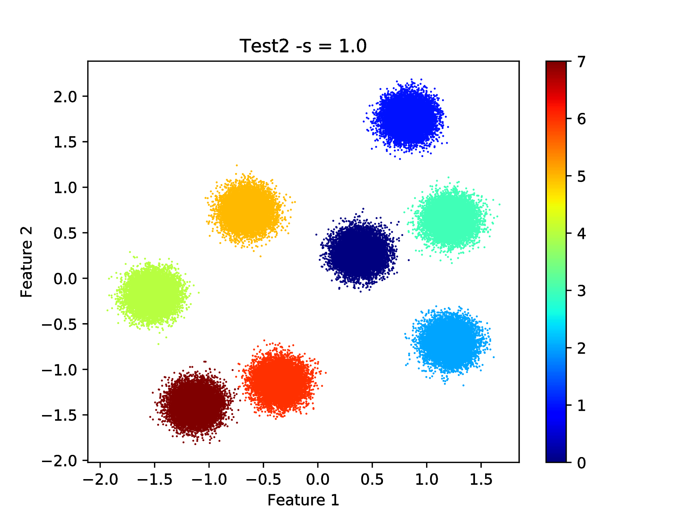
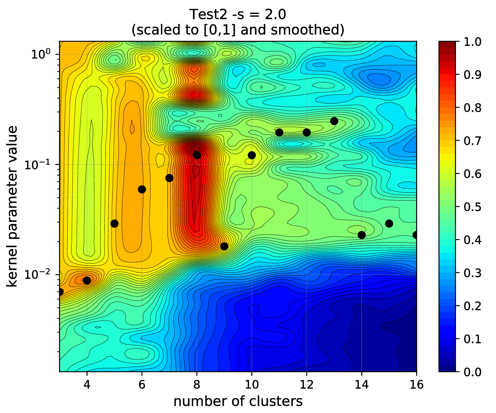
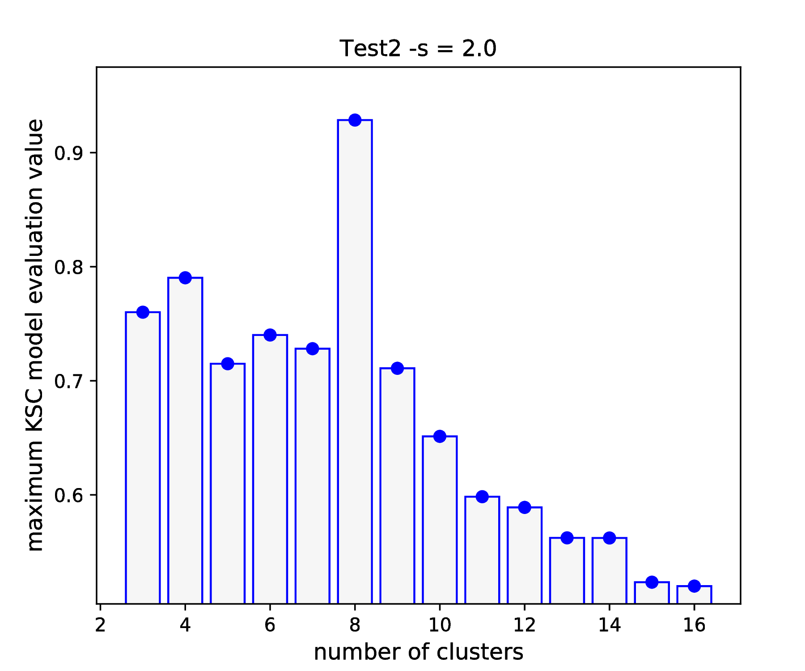
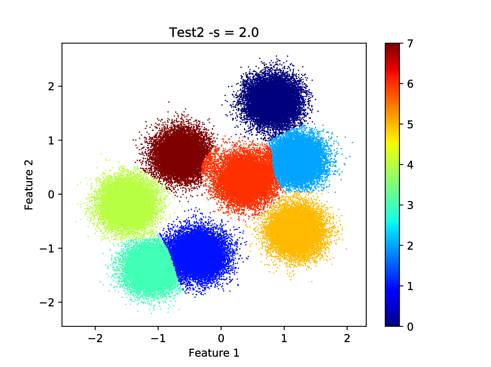
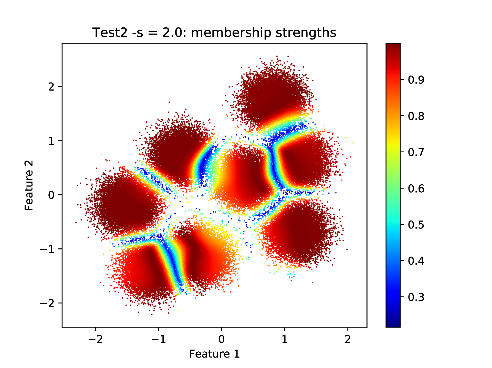
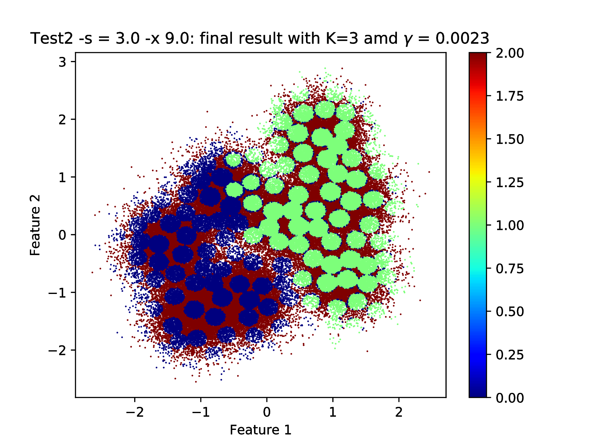
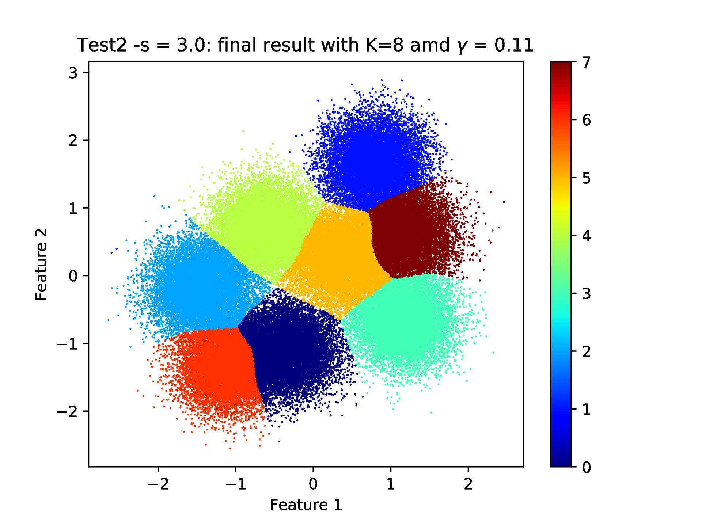
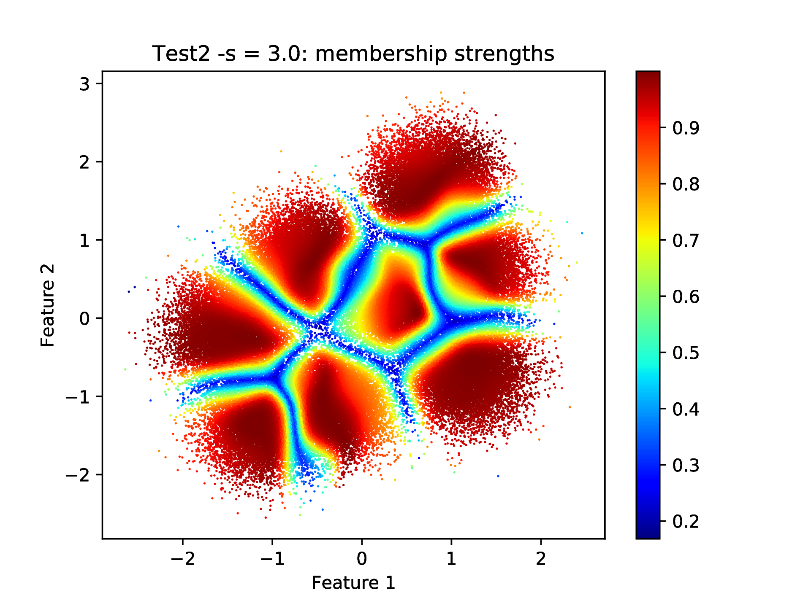
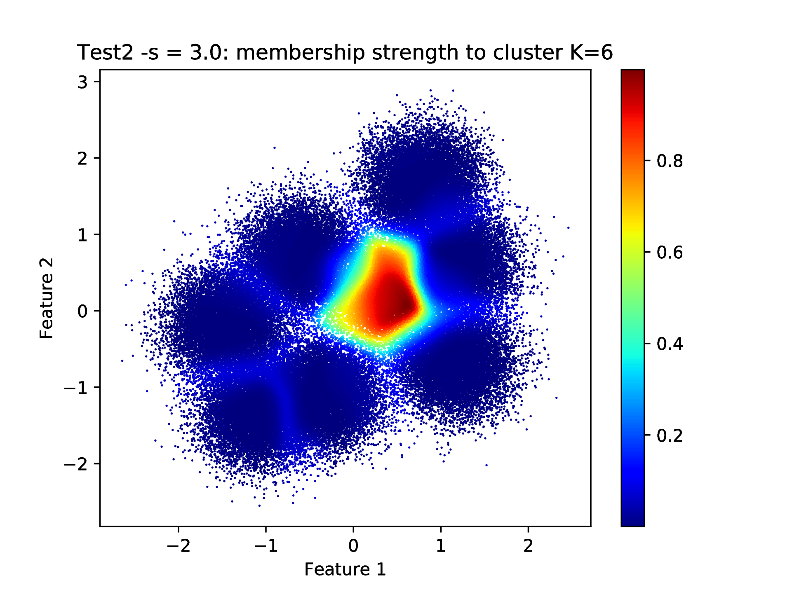

.. _sec_test2:

Test2
=======

After the static, simply clustering problem of :ref:`Test1 <sec_test1>`, this is 
a more dynamic test due to the inclusion of the data generation. The complexity of 
the underlying clustering problem can range from the very easy, linearly separable,  
:ref:`Test1 <sec_test1>`-like to more complicated, high dimensional and overlapping
cases thanks to some configurable parameters of the 
:ref:`kscICholTest2.py <kscICholTest2_doc>` data generator script. This test
is used to illustrate the dependence of the KSC application input parameter values 
on the nature (dimensionality, separation, etc.) of the given clustering problem.

Description of the problem
-----------------------------

Similarly to :ref:`Test1 <sec_test1>`, data are generated form isotropic Gaussian 
distributions with common constant standard deviation. However, the data set is 
generated dynamically as part of the test, which makes possible to set some of 
the properties of the underlying problem such as the number of features 
(dimension), number of cluster centers, as well as their minimum separation or 
the constant standard deviation of the underlying Gaussian distributions.
The size of the generated data set, as well as the training and validation 
sub-sample sizes, might also be specified.

This gives the flexibility to generate clustering problems ranging from an easy
(linearly separable, low dimensional, low cluster number and data set size i.e. 
similar to :ref:`Test1 <sec_test1>`) to a bit more challenging (overlapping, 
and/or high number of clusters possible in high dimensional space) problems. 

The test
---------

One can execute the related :ref:`kscICholTest2.py <kscICholTest2_doc>` script 
to generate data and KSC application shell scripts with their **initial parameters** 
according to the default configuration of the script (see more at the documentation
of :ref:`kscICholTest2.py <kscICholTest2_doc>`). This generates a clustering 
problem that is very similar to that solved in case of :ref:`Test1 <sec_test1>`.
In the first part, we will start with solving this initial easy problem, then 
making it more and more challenging by increasing the overlap between the clusters.
A high dimensional data set, with high number of cluster ceneters and sample size 
will be generated and explored in the second part by means of the KSC models 
using the provided KSC applications. 

Overlapping clusters
^^^^^^^^^^^^^^^^^^^^

**Standard deviation** :math:`\texttt{-s 1.0}`:

First the data set will be generated by keeping all parameters as default (100 
000 samples from 8, 2 dimensional cluster centers in isotropic Gaussian 
distributions) except the common constant standard deviation of the Gaussians 
that will be set to 1.0 ::

    bash-3.2$ python kscICholTest2.py -s 1.0
     ==== (Python) === : Parameters (-flag to change) ...
      ---------------------------------------------------------- 
      --- Number of cluster centers (-c)         :            8
      --- Number of features (-f)                :            2
      --- Number of smaples (-n)                 :    1.000e+05
      --- Training sub-smaples (-t)              :    2.000e+04
      --- Validation sub-smaples (-v)            :    1.000e+04
      --- Min. cluster center distance (-d)      :    5.000e+00
      --- STDV of the underlying Gaussians (-s)  :    1.000e+00
      --- Scaling of the kernel BW estimate (-x) :    5.657e+01
      --- Inc. Cholesky error tolerance (-e)     :    8.500e-01
      --- Inc. Cholesky maxium rank (-r)         :    3.000e+02
      --- KSC membership encoding-decoding (-m)  :          AMS
      ---------------------------------------------------------- 
     ==== (Python) === : Generating data ...
     ==== (Python) === : Generating (initial) script for hyper-parameter tuning ...
     ==== (Python) === : Generating (initial) script for training ...
     ==== (Python) === : Generating (initial) script for testing ...
 
Note, that one could easily visualise the data (or the 20 000 sub-samples for 
training) in order to gain insights into it. However, the process shown here 
is kept to be such that it might be applicable in general.

The first and very important step (as discussed in :ref:`sec_icd` Section) is to find 
suitable parameter values applied for the incomplete Cholesky approximation (IDC) of 
the training data kernel matrix. One can utilise the :math:`\texttt{KscIchol}\_\texttt{Train}` 
KSC application provided for training (i.e. relying solely on the training 
data set) and investigate the effect of varying the incomplete Cholesky 
factorisation related input parameters. The :math:`\texttt{runKSCIchol}\_\texttt{Train.sh}`
shell script is generated with some **initial values** of the input parameters 
of the KSC training application in order to facilitate this step. 

.. note:: 
   The generated scripts will contains parameter values that are known (e.g. 
   training data size, location, etc...) and some that are only estimated. 
   Therefore, these shell scripts provide only the initial list of the 
   possible (required and optional) input arguments of the corresponding KSC 
   application with initial values that might be revised later.

In order to make the provided shell scripts executable, one needs to change their 
access permission as (assuming that the current directory is :math:`\texttt{/tests/test2}`) ::

    bash-3.2$ chmod +x *.sh 
   
Executing the KSC training application with the generated 
:math:`\texttt{runKSCIchol}\_\texttt{Train.sh}` shell script with its 
initial parameters for the ICD part as ::

    bash-3.2$ ./runKSCIchol_Train.sh 

     ===============================================================

     Ksc Training Input Parameters (with defaults for optionals):

      ------ Cholesky decomposition related: 
      icholTolError              = 0.85
      icholMaxRank               = 300
      icholRBFKernelPar          = {0.0035068, 0.005194}  --> 2 number of parameters. 
      icholRedSetFile            = out/ReducedSetData.dat
      icholPermVectFile          = out/PermutationVector.dat
      ...
      ---- Starts: incomplete Cholesky decomposition of the Kernel matrix.
      ---- Finished: incomplete Cholesky decomposition of the Kernel matrix
           ---> Duration of ICD  : 0.346872 [s]
           ---> Final error      : 0.848522
           ---> Rank of the aprx : 110
           ---> Dimensions of G  :(20000 x 110)
      ...

gives the above results. As it can be seen, the ICD of the training data kernel  
kernel matrix yields an approximation with a (low) rank of 110 while the 
corresponding error is less than 0.85. These indicate, that the selected kernel 
parameters are within the range of the limits mentioned in the :ref:`sec_icd` Section. This 
can also be confirmed by having a look into the generated :math:`\texttt{out/PermutationVector.dat}`
file, that contains the indices of the (feature map of the) training data that 
were used during the ICD to build up the approximation (i.e. permutations): 
it shows that data are nicely selected covering the whole range of indices when 
using the given kernel parameter values. 

Since the ICD part, with its initial parameters, seems to be fine, we can move 
on and try to find out the optimal values of the hyper parameters by the help 
of the :math:`\texttt{KscIchol}\_\texttt{Tune}` application. This can be done 
by executing the generated :math:`\texttt{runKSCIchol}\_\texttt{Tune.sh}` shell 
script that contains the same estimates of the ICD related parameters as the 
above :math:`\texttt{runKSCIchol}\_\texttt{Train.sh}` script ::

  bash-3.2$ ./runKSCIchol_Tune.sh 

   ===============================================================

   Ksc Tuning Input Parameters (with defaults for optionals):

    ------ Cholesky decomposition related: 
    icholTolError              = 0.85
    icholMaxRank               = 300
    icholRBFKernelPar          = {0.0035068, 0.005194}  --> 2 number of parameters. 
    ------ Training data set related: 
    trDataNumber               = 20000
    trDataDimension            = 2
    trDataFile                 = data/data_Train_N20000.dat

    ------ Validation data set related: 
    valDataNumber              = 10000
    ...
    ...
    ...
    === KscWkpcaIChol::Tune : tuning for the 28-th kernel paraeters out of the 29
    === KscWkpcaIChol::Tune : tuning for the 29-th kernel paraeters out of the 29
     ---- Finished: training the KSC model
          ---> Duration         :   4.86614 [s]
          ---> The encoding(QM) :   AMS
          --->   Eta balance    :   0.5
          --->   Outlier thres. :   5
          --->   Optimality     :   
                 - QM value          : 0.960974
                 - number of clusters: 8
                 - kernel par. indx. : 8 ( = 0.0014625 )
          ---> Result is written: out/TuningRes

The hyper parameter tuning reports 8 cluster centers and the RBF kernel parameter 
of 0.00146 as optimal values with a high AMS model selection criterion value of 
:math:`\sim 0.96`. One can visualise the complete results of the hyper parameter 
tuning as ::

    bash-3.2$ python ../utils/plotResTuning.py -f out/TuningRes --title "Test2 -s = 1.0" --saveTo "out/fig" 

that generates the figures shown in :numref:`test2_tuning_s1_2D` 
and :numref:`test2_tuning_s1_1D`. One can see, that the optimality 
actually holds for kernel parameter values in the range of 
:math:`\sim 0.00146 - 0.06`. One can select 0.03 in this case as a mid-value. 

 .. figure::   figs/s1/fig_test2_tuning_s1_2D.png
    :scale:    25 %
    :figclass: align-center
    :name:     test2_tuning_s1_2D        

 .. figure::   figs/s1/fig_test2_tuning_s1_1D.png
    :scale:    25 %
    :figclass: align-center
    :name:     test2_tuning_s1_1D        

    Results of the KSC hyper parameter tuning application.
 
 
Having the optimal parameter values both for the ICD part and for the cluster 
number and RBF kernel parameter determined, one can train a KSC model on the 
training set and utilise it to cluster the whole data set. This can be done by 
using the :math:`\texttt{KscIchol}\_\texttt{Test}` KSC application. The 
:math:`\texttt{runKSCIchol}\_\texttt{Test.sh}` shell script is generated with 
initial parameter values of this application. One needs to make edit this 
shell script in order to make sure, that the optimal hyper parameter values
(selected above) are used. This can be done by editing the 
:math:`\texttt{runKSCIchol}\_\texttt{Test.sh}` shell script and set 
the :math:`\texttt{--clRBFKernelPar}` argument to its optimal value of 0.03.

Executing the edited script provides the following complete output ::

  bash-3.2$ ./runKSCIchol_Test.sh 

   ===============================================================

   Ksc Training & Testing Input Parameters (with defaults for optionals):

    ------ Cholesky decomposition related: 
    icholTolError              = 0.85
    icholMaxRank               = 300
    icholRBFKernelPar          = {0.0035068, 0.005194}  --> 2 number of parameters. 

    ------ Training data set related: 
    trDataNumber               = 20000
    trDataDimension            = 2
    trDataFile                 = data/data_Train_N20000.dat

    ------ Test data set related: 
    tstDataNumber              = 100000
    tstDataFile                = data/data.dat

    ------ Clustering related: 
    clNumber                   = 8
    clRBFKernelPar             = 0.03
    clEncodingScheme(BAS=2)    = 1
    clEvalOutlierThrs(0)       = 5
    clEvalWBalance(0.2)        = 0.5
    clResFile(CRes.dat)        = out/CRes.dat
    clLevel(1)                 = 1

    ------ Other, optional parameters: 
    verbosityLevel(2)          = 2
    numBLASThreads(4)          = 4

   ===============================================================

   ---- Starts: allocating memory for and loading the training data.
   ---- Finished: allocating memory for and loading the training data:
        ---> Dimensions of M  :(20000 x 2)

   ---- Starts: incomplete Cholesky decomposition of the Kernel matrix.
   ---- Finished: incomplete Cholesky decomposition of the Kernel matrix
        ---> Duration of ICD  : 0.339654 [s]
        ---> Final error      : 0.848522
        ---> Rank of the aprx : 110
        ---> Dimensions of G  :(20000 x 110)

   ---- Starts: training the KSC model.
     ---> Using Open BLAS on 4 threads.
            ====> Starts computing eigenvectors... 
     ---> Using Open BLAS on 4 threads.
            ====> Starts forming the Reduced-Reduced and Reduced-Test kernelmatrix... 
            ====> Starts computing the reduced set coefs... 
            ====> Starts generating encoding... 
   ---- Finished: training the KSC model
        ---> Duration         : 0.131173 [s]
        ---> The encoding(QM) : AMS
        --->   Quality value  : 0.966807
        --->   Eta balance    : 0.5
        --->   Outlier thres. : 5

   ---- Starts: allocating memory for and loading the test data.
   ---- Finished: allocating memory for and loading the test data:
        ---> Dimensions of M  :(100000 x 2)

   ---- Starts: clustering the test data with the KSC model.
     ---> Using Open BLAS on 4 threads.
   ---- Finished: test data cluster assignment
        ---> Duration         : 0.197993 [s]
        ---> The encoding(QM) : AMS
        --->   Quality value  : 0.999708
        --->   Eta balance    : 0.5
        ---> Result is writen : 
        --->   Clustering     : out/CRes.dat

The high 0.9997 value of the final model selection criterion, computed on the 
whole test set of 100 000 samples indicates a very high quality clustering 
result. This can be verified by computing the corresponding Adjusted Rand Index 
(ARI) since the optimal partition of the data set is known in this case. This 
can be done as ::

    bash-3.2$ python ../utils/evaluateClusteringRes.py -c out/CRes.dat  -t data/data_Labels.dat 
     ==== (Python) === : Evaluating clustering result ...
       ---- (Python) --- : Computing Adjusted-Rand-Score ...
        ===> The Adjusted Rand-Score =  1.000
 
that shows indeed a perfect clustering result. Since the data set is 2 dimensional, 
the final results can be visualised as well ::

    bash-3.2$ python ../utils/plotClusteringRes.py -d data/data.dat -l out/CRes.dat --title "Test2 -s = 1.0"
     ==== (Python) === : visualising the result of the clustering...

that will generate the plot shown in :numref:`test2_res_s1`.

   Final result of clustering with the KSC test (out-of-sample extension) application.
 
Note, that this clustering problem was relatively easy since the clusters are 
linearly separable. The overlap, between the clusters in the 
generated data sets, will be increased in the following by increasing the 
standard deviation of the underlying Gaussian distributions. The same steps 
as above (e.g. using the KSC training to check the ICD parameters, using the 
KSC tuning for hyper parameter tuning and KSC test for clustering the whole 
data set) will be repeated for each data set with lower level of verbosity.

....
  
**Standard deviation** :math:`\texttt{-s 2.0}`:

 
The next data set will be the same as above but with a standard deviation of 2.0 
that will result in slightly overlapping clusters.  Generating ::

    bash-3.2$ python kscICholTest2.py -s 2.0
     ==== (Python) === : Parameters (-flag to change) ...
      ---------------------------------------------------------- 
      --- Number of cluster centers (-c)         :            8
      --- Number of features (-f)                :            2
      --- Number of smaples (-n)                 :    1.000e+05
      --- Training sub-smaples (-t)              :    2.000e+04
      --- Validation sub-smaples (-v)            :    1.000e+04
      --- Min. cluster center distance (-d)      :    5.000e+00
      --- STDV of the underlying Gaussians (-s)  :    2.000e+00
      --- Scaling of the kernel BW estimate (-x) :    5.657e+01
      --- Inc. Cholesky error tolerance (-e)     :    8.500e-01
      --- Inc. Cholesky maxium rank (-r)         :    3.000e+02
      --- KSC membership encoding-decoding (-m)  :          AMS
      ---------------------------------------------------------- 
     ==== (Python) === : Generating data ...
     ==== (Python) === : Generating (initial) script for hyper-parameter tuning ...
     ==== (Python) === : Generating (initial) script for training ...
     ==== (Python) === : Generating (initial) script for testing ...

and running the training to check if the ICD parameters are fine ::

    bash-3.2$ ./runKSCIchol_Train.sh 
    ...
    ...
    ---- Finished: incomplete Cholesky decomposition of the Kernel matrix
         ---> Duration of ICD  : 0.074003 [s]
         ---> Final error      : 0.842915
         ---> Rank of the aprx : 62
         ---> Dimensions of G  :(20000 x 62)
    ...

which shows a bit low rank of the corresponding approximation (based only on 
63 data point out of the 20 000) but let's keep going further and see if the 
hyper parameter tuning finds any combination of the KSC cluster number and RBF 
kernel parameter that yields with a high quality KSC model even with this 
approximation based only on 63 data points ::

    bash-3.2$ ./runKSCIchol_Tune.sh 
    ...
    ...
    === KscWkpcaIChol::Tune : tuning for the 29-th kernel paraeters out of the 29
    ---- Finished: training the KSC model
         ---> Duration         :   2.58556 [s]
         ---> The encoding(QM) :   AMS
         --->   Eta balance    :   0.5
         --->   Outlier thres. :   5
         --->   Optimality     :   
                - QM value          : 0.928558
                - number of clusters: 8
                - kernel par. indx. : 19 ( = 0.12136 )
         ---> Result is written: out/TuningRes

This shows, that actually a good KSC model, with model selection criterion value 
of 0.928 on the validation set, could be trained on the training set with the 
optimal 8 cluster centers and  0.12 RBF kernel parameters. By visualising the 
result of the tuning ::

    bash-3.2$ python ../utils/plotResTuning.py -f out/TuningRes --title "Test2 -s = 2.0"

shows the :numref:`test2_tuning_s2_2D` and :numref:`test2_tuning_s2_1D` figures 
that confirms the optimality of the 8 cluster centers and RBF kernel parameter 
value of 0.12. 
 

   Results of the KSC hyper parameter tuning application.
 
One can also visualise the result of hyper parameter tuning as a 2D image without 
any smoothing by setting the *smoothing* related input argument to 1 as :: 
 
  bash-3.2$ python ../utils/plotResTuning.py -f out/TuningRes -s 1.0 --title "Test2 -s = 2.0"

Editing the :math:`\texttt{runKSCIchol}\_\texttt{Test.sh}` shell script generated 
for testing (i.e. clustering the whole generated data set) and setting the 
required number of clusters and RBF kernel parameter values to these optimal ::

    --clNumber 8 \
    --clRBFKernelPar 0.12 \

then executing ::

    bash-3.2$ ./runKSCIchol_Test.sh 
    ...
    ...
    ---- Finished: test data cluster assignment
          ---> Duration         : 0.108512 [s]
          ---> The encoding(QM) : AMS
          --->   Quality value  : 0.91835
          --->   Eta balance    : 0.5
          ---> Result is writen : 
          --->   Clustering     : out/CRes.dat

provides a clustering result with a high KSC model selection criterion (computed 
on the whole data set). The computed ARI ::

    bash-3.2$ python ../utils/evaluateClusteringRes.py -c out/CRes.dat  -t data/data_Labels.dat 
     ==== (Python) === : Evaluating clustering result ...
       ---- (Python) --- : Computing Adjusted-Rand-Score ...
        ===> The Adjusted Rand-Score =  0.949

confirms that the corresponding clustering is actually a high quality partition 
of the data set. This is respectively true since perfect clustering is not possible 
due to the overlapping clusters. The good quality of the partition as well as the 
level of overlap can also be seen by visualising the final result :numref:`test2_res_s2` ::

  bash-3.2$ python ../utils/plotClusteringRes.py -d data/data.dat -l out/CRes.dat --title "Test2 -s = 2.0"
   ==== (Python) === : visualising the result of the clustering...

that shows indeed the overlaps. 

   Final result of clustering with the KSC test (out-of-sample extension) application.

At this point one can make use of the additional information provided by the KSC 
training and test applications. When these two applications are used with the 
:math:`\texttt{AMS}` (Average Membership Strength) or :math:`\texttt{BAS}`
(Balanced Angular Similarly) cluster membership encoding-decoding schemes, and 
the :math:`\texttt{--clLevel}` input argument is set to 1, the results saved 
into the :math`\texttt{out/CRes.dat}` file will contain the following informations

 - first column: discrete cluster membership indicator.
 - second column: soft cluster membership indicator i.e. strength that the give 
   data belongs to the cluster indicated in the first column.

Moreover, when the :math:`\texttt{AMS}` encoding scheme is used together with 
the math:`\texttt{--clLevel}` input argument set to be 2, the results saved 
into the :math`\texttt{out/CRes.dat}` file will contain the following informations

 - first column: discrete cluster membership indicator.
 - the k-th column: contains the soft cluster membership indicator value for the 
   (k-1)-th cluster, i.e. the strength, that the given data point belongs to 
   the (k-1)-th cluster.

The :ref:`plotClusteringRes.py <plotClusteringRes_doc>` can take the related 
column index as an input argument and the given cluster membership strength 
can be visualised instead of the binary cluster indicators. In our case :: 
 
  python ../utils/plotClusteringRes.py -d data/data.dat -l out/CRes.dat --title "Test2 -s = 2.0" -t 1
   ==== (Python) === : visualising the result of the clustering...

should show the cluster membership strengths as in :numref:`test2_res_strength_s2`
that corresponds to the clustering shown in :numref:`test2_res_s2`.

   Final result of clustering with the KSC test (out-of-sample extension) 
   application: cluster membership strengths that corresponds to the clustering 
   results shown in :numref:`test2_res_s2` figure.

....

**Standard deviation** :math:`\texttt{-s 3.0}`:

If we keep increasing the cluster overlaps and generated a new data set with 
a standard deviation of the underlying Gaussian equal to :math:`\texttt{-s 3.0}` ::

    bash-3.2$ python kscICholTest2.py -s 3.0 
     ==== (Python) === : Parameters (-flag to change) ...
      ---------------------------------------------------------- 
      --- Number of cluster centers (-c)         :            8
      --- Number of features (-f)                :            2
      --- Number of smaples (-n)                 :    1.000e+05
      --- Training sub-smaples (-t)              :    2.000e+04
      --- Validation sub-smaples (-v)            :    1.000e+04
      --- Min. cluster center distance (-d)      :    5.000e+00
      --- STDV of the underlying Gaussians (-s)  :    3.000e+00
      --- Scaling of the kernel BW estimate (-x) :    5.657e+01
      --- Inc. Cholesky error tolerance (-e)     :    8.500e-01
      --- Inc. Cholesky maxium rank (-r)         :    3.000e+02
      --- KSC membership encoding-decoding (-m)  :          AMS
      ---------------------------------------------------------- 
     ==== (Python) === : Generating data ...
     ==== (Python) === : Generating (initial) script for hyper-parameter tuning ...
     ==== (Python) === : Generating (initial) script for training ...
     ==== (Python) === : Generating (initial) script for testing ...
 
and running the KSC test application to see whether the generated, initial values 
of the ICD part are in the correct range :: 

    bash-3.2$ ./runKSCIchol_Train.sh 
    ...
    ...
    ---- Finished: incomplete Cholesky decomposition of the Kernel matrix
         ---> Duration of ICD  : 0.041386 [s]
         ---> Final error      : 0.838067
         ---> Rank of the aprx : 38
         ---> Dimensions of G  :(20000 x 38)
    ...
    ...

we can see that the initial parameters ICD related parameter values results in a 
very low rank approximation of the training data kernel matrix based only on 
38 points. At the same time, the corresponding approximation error decreases 
rapidly with the number of selected points and already drops below the given 
threshold of 0.85 with these 38 points. This is an indication that either the 
ICD RBF kernel parameter values are too high (compared to the distances within 
the structure in underlying data) and/or the chosen approximation error 
tolerance is too high. Let's see both possibles.

**Lowering the kernel parameter values of the ICD phase**:

One could decrease the scaling factor of the RBF kernel parameter estimation in 
order to reduce their values e.g. by :math:`\texttt{python kscICholTest2.py -s 3.0 -x 9.0}`
that would change the default :math:`\sim \texttt{56} \to \texttt{9}` and 
bring the initial kernel parameter values from :math:`\sim \texttt{0.06} \to \sim \texttt{0.01}`.
While this would indeed increase the number of selected data points i.e. the 
rank of the approximation while the same :math:`\texttt{0.85}` tolerated 
approximation error is reached, clustering the whole data set (after the hyper 
parameter tuning with the resulted optimal cluster number of 3) would result 
in small, separated clusters as shown in :numref:`test3_res_s3_small`. 
This is due to the too low value of the ICD RBF kernel parameter that results 
in a "many block structure", high rank (higher than the optimal) training data 
kernel matrix.

   Final result of clustering with the KSC test (out-of-sample extension) 
   application: when using :math:`\texttt{-s 3.0 -x 9}` that results in a data 
   set with optimal number of cluster centers of 3 and RBF kernel parameter of 
   0.0023 hyper parameters.
   
   
**Lowering the tolerated approximation error in the ICD phase**:
 
One can keep the structures of the training data kernel matrix, generated by the 
initial RBF kernel parameter value, and lower the tolerated approximation error 
of the ICD based training kernel matrix approximation in order to increase the 
accuracy of the approximation (i.e. higher rank approximation based on a higher 
number of selected data points). This can be achieved by regenerating the KSC 
application shell scripts with the required tolerated error of the ICD phase 
(e.g. 0.6 instead of the default 0.85) ::

    bash-3.2$ python kscICholTest2.py -s 3.0 -e 0.6
     ==== (Python) === : Parameters (-flag to change) ...
      ---------------------------------------------------------- 
      --- Number of cluster centers (-c)         :            8
      --- Number of features (-f)                :            2
      --- Number of smaples (-n)                 :    1.000e+05
      --- Training sub-smaples (-t)              :    2.000e+04
      --- Validation sub-smaples (-v)            :    1.000e+04
      --- Min. cluster center distance (-d)      :    5.000e+00
      --- STDV of the underlying Gaussians (-s)  :    3.000e+00
      --- Scaling of the kernel BW estimate (-x) :    5.657e+01
      --- Inc. Cholesky error tolerance (-e)     :    6.000e-01
      --- Inc. Cholesky maxium rank (-r)         :    3.000e+02
      --- KSC membership encoding-decoding (-m)  :          AMS
      ---------------------------------------------------------- 
     ==== (Python) === : Generating data ...
     ==== (Python) === : Generating (initial) script for hyper-parameter tuning ...
     ==== (Python) === : Generating (initial) script for training ...
     ==== (Python) === : Generating (initial) script for testing ...

Running the training script to check the effects of this 
:math:`\texttt{--icholTolError 0.85}` :math:`\to \texttt{--icholTolError 0.6}`
modification, one can 
see that the rank of the ICD based approximation of the training data kernel 
matrix :math:`\texttt{---> Rank of the aprx : 38}` 
:math:`\to \texttt{---> Rank of the aprx : 84}` 
is indeed higher (i.e. based on 84 data points).

Executing the hyper parameter tuning reports the optimality at 4 number of 
cluster centers and an RBF kernel parameter value of 1.04 with a maximum 
value of the KSC AMS model selection criterion of 0.85. However, investigating
the whole result of the hyper parameter tuning by plotting reveals, that the 
hyper parameter combination of 8 clusters and RBF kernel parameter of 0.11 (i.e. 
the mid-value of 0.07 and 0.15) gives a similar model selection criterion of 0.82.

By choosing this above hyper parameter combination, editing and executing the
:math:`\texttt{runKSCIchol}\_\texttt{Test.sh}` script for testing (out-of-sample 
extension) ::

    bash-3.2$ ./runKSCIchol_Test.sh 

     ===============================================================

     Ksc Training & Testing Input Parameters (with defaults for optionals):

      ------ Cholesky decomposition related: 
      icholTolError              = 0.6
      icholMaxRank               = 300
      icholRBFKernelPar          = {0.064239, 0.072412}  --> 2 number of parameters. 

      ------ Training data set related: 
      trDataNumber               = 20000
      trDataDimension            = 2
      trDataFile                 = data/data_Train_N20000.dat

      ------ Test data set related: 
      tstDataNumber              = 100000
      tstDataFile                = data/data.dat

      ------ Clustering related: 
      clNumber                   = 8
      clRBFKernelPar             = 0.11
      clEncodingScheme(BAS=2)    = 1
      clEvalOutlierThrs(0)       = 5
      clEvalWBalance(0.2)        = 0.5
      clResFile(CRes.dat)        = out/CRes.dat
      clLevel(1)                 = 1

      ------ Other, optional parameters: 
      verbosityLevel(2)          = 2
      numBLASThreads(4)          = 4

     ===============================================================

     ---- Starts: allocating memory for and loading the training data.
     ---- Finished: allocating memory for and loading the training data:
          ---> Dimensions of M  :(20000 x 2)

     ---- Starts: incomplete Cholesky decomposition of the Kernel matrix.
     ---- Finished: incomplete Cholesky decomposition of the Kernel matrix
          ---> Duration of ICD  : 0.104451 [s]
          ---> Final error      : 0.592256
          ---> Rank of the aprx : 84
          ---> Dimensions of G  :(20000 x 84)

     ---- Starts: training the KSC model.
       ---> Using Open BLAS on 4 threads.
              ====> Starts computing eigenvectors... 
       ---> Using Open BLAS on 4 threads.
              ====> Starts forming the Reduced-Reduced and Reduced-Test kernelmatrix... 
              ====> Starts computing the reduced set coefs... 
              ====> Starts generating encoding... 
     ---- Finished: training the KSC model
          ---> Duration         : 0.077449 [s]
          ---> The encoding(QM) : AMS
          --->   Quality value  : 0.803193
          --->   Eta balance    : 0.5
          --->   Outlier thres. : 5

     ---- Starts: allocating memory for and loading the test data.
     ---- Finished: allocating memory for and loading the test data:
          ---> Dimensions of M  :(100000 x 2)

     ---- Starts: clustering the test data with the KSC model.
       ---> Using Open BLAS on 4 threads.
     ---- Finished: test data cluster assignment
          ---> Duration         : 0.145989 [s]
          ---> The encoding(QM) : AMS
          --->   Quality value  : 0.812439
          --->   Eta balance    : 0.5
          ---> Result is writen : 
          --->   Clustering     : out/CRes.dat

gives the final partition of the whole data set shown in :numref:`test3_res_s3`.

   Final result of clustering with the KSC test (out-of-sample extension) 
   application: when using :math:`\texttt{-s 3.0 -e 0.6}` that results in a data 
   set with optimal number of cluster centers of 8 and RBF kernel parameter of 
   0.11 hyper parameters.

The corresponding membership strengths can also be plotted as ::

    bash-3.2$ python ../utils/plotClusteringRes.py -d data/data.dat -l out/CRes.dat --title "Test2 -s = 3.0: membership strengths" -t 1

As the result, shown in :numref:``

   Cluster membership strengths that corresponds to the clustering result shown 
   in :numref:`test3_res_s3` above.

As it was mentioned previously, when the :math:`\texttt{--clLevel}` KSC application 
input argument is set to 2 with the AMS cluster membership encoding-decoding scheme, 
the membership strengths to each cluster is computed for each points. Therefore, 
by editing the :math:`\texttt{--clLevel}` parameter of the 
:math:`\texttt{runKSCIchol}\_\texttt{Test.sh}` script, i.e. setting it to 2,  
re-run, one can plot the membership strengths to e.g. cluster number 6 ::

  bash-3.2$ python ../utils/plotClusteringRes.py -d data/data.dat -l out/CRes.dat --title "Test2 -s = 3.0: membership strength to cluster K=6" -t 6

as shown in :numref:`test3_res_strength_to_K6_s3`. 

   Cluster membership strengths for each points for belonging to cluster number 
   K=6 in case of clustering results shown in :numref:`test3_res_s3` above.

High dimensional problem with high number of clusters
^^^^^^^^^^^^^^^^^^^^^^^^^^^^^^^^^^^^^^^^^^^^^^^^^^^^^^

A data set with 16, 32 dimensional cluster centers are generated form isotropic 
Gaussians with a common, constant standard deviation of 5 as ::

    bash-3.2$ python kscICholTest2.py -s 5.0 -c 16 -f 32
     ==== (Python) === : Parameters (-flag to change) ...
      ---------------------------------------------------------- 
      --- Number of cluster centers (-c)         :           16
      --- Number of features (-f)                :           32
      --- Number of smaples (-n)                 :    1.000e+05
      --- Training sub-smaples (-t)              :    2.000e+04
      --- Validation sub-smaples (-v)            :    1.000e+04
      --- Min. cluster center distance (-d)      :    5.000e+00
      --- STDV of the underlying Gaussians (-s)  :    5.000e+00
      --- Scaling of the kernel BW estimate (-x) :    5.657e+01
      --- Inc. Cholesky error tolerance (-e)     :    8.500e-01
      --- Inc. Cholesky maxium rank (-r)         :    3.000e+02
      --- KSC membership encoding-decoding (-m)  :          AMS
      ---------------------------------------------------------- 
     ==== (Python) === : Generating data ...
     ==== (Python) === : Generating (initial) script for hyper-parameter tuning ...
     ==== (Python) === : Generating (initial) script for training ...
     ==== (Python) === : Generating (initial) script for testing ...

Similarly as above, one can use the generated shell script for executing the KSC 
training application for investigating if the initial values of the ICD related 
parameters are correct ::

    bash-3.2$ ./runKSCIchol_Train.sh 
    ...
    ...
    ------ Cholesky decomposition related: 
    icholTolError              = 0.85
    icholMaxRank               = 300
    icholRBFKernelPar          = {0.19504, 0.15641, ..., 0.25194}  --> 32 number of parameters. 
    icholRedSetFile            = out/ReducedSetData.dat
    icholPermVectFile          = out/PermutationVector.dat
    ...
    ...
    ---- Finished: incomplete Cholesky decomposition of the Kernel matrix
         ---> Duration of ICD  : 2.62444 [s]
         ---> Final error      : 0.985
         ---> Rank of the aprx : 300
    ...
    ...

The ICD related report shows, that the approximation error decreases only 
very slowly (:math:`\texttt{Final error : 0.985}` based on :math:`\texttt{300}` data). 
Moreover, investigating the pivoting, by looking into the generated 
:math:`\texttt{out/PermutationVector.dat} file, reveals that the initial values of the ICD 
related RBF kernel parameters are far too small. These parameter values can 
be scaled by providing the corresponding scaling factor to the shell script 
generator after the :math:`\texttt{-x}` flag. The above print-out shows a defalut 
scaling factor of :math:`\sim \texttt{56}`, that can be increased till a 
different behaviour of the ICD is reported. By doing so, one can see that a relatively 
large scaling factor of :math:`\texttt{-x 1000}` is needed to change the above ICD 
result and start to decrease the reported error to :math:`\texttt{0.982771}`. 
However, one needs to keep increasing the scaling factor further to 
:math:`\texttt{-x 2500}` to obtain a faster decrease in the approximation error 
down to :math:`\texttt{0.849844}`, with a rank of :math:`\texttt{259}` which 
indicates, that the corresponding kernel results in a low rank training data 
kernel matrix, i.e. reflecting to some structure in the data. One could keep 
increasing the RBF kernel parameter value even with a scaling of 
:math:`\texttt{-x 5000}` that would result a very sparse approximation, with a 
rank of only :math:`\texttt{19}`. While the clustering (tuning, then testing with 
the obtained optimal parameters) would be perfect even with this very sparse 
approximation, our goal here to show the evolution of the optimality of the hyper parameters 
with an increasing spread of the clusters. Therefore, a scaling with an
intermediate value of :math:`\texttt{-x 3300}` will be used in the following. 

First, data are generated from the above 16, 32 dimensional cluster centers 
with *increasing standard deviations* ranging from 2.5 till 5.5. The corresponding 
KSC application scripts are also generated together with initial parameter 
values (the above scaling of ICD related RBF kernel parameter estimate is used) 
e.g. for standard deviation of 2.5 as ::

  bash-3.2$ python kscICholTest2.py -s 2.5 -c 16 -f 32 -x 3300

Then in each case, the hyper parameter tuning is performed (i.e. the generated 
:math:`\texttt{runKSCIchol}\_\texttt{Tune.sh}` shell script is executed) that 
provides the results shown in :numref:`fig_c16s32_4_2D`.

 +-----------------------------------------+-----------------------------------------+
 | .. figure::   figs/c16f32/f_s2p5_2D.png | .. figure::   figs/c16f32/f_s3p5_2D.png |
 |   :scale:    25 %                       |   :scale:    25 %                       |
 |   :figclass: align-center               |   :figclass: align-center               |
 +-----------------------------------------+-----------------------------------------+
 | .. figure::   figs/c16f32/f_s4p5_2D.png | .. figure::   figs/c16f32/f_s5p5_2D.png |
 |   :scale:    25 %                       |   :scale:    25 %                       |
 |   :figclass: align-center               |   :figclass: align-center               |
 +-----------------------------------------+-----------------------------------------+
 | .. figure:: figs/fig_dummy.png                                                    |
 |  :name: fig_c16s32_4_2D                                                           |
 |                                                                                   |
 |  Results of the hyper parameter tuning KSC application when applied on the data   |
 |  set generated with different standard deviations (indicated in the titles as the | 
 |  :math:`\texttt{-s}` input argument values) of the underlying 16, 32-dimensional, |
 |  isotropic Gaussians.                                                             |
 +-----------------------------------------------------------------------------------+
 

Note, how the range of the optimal kernel parameter values is shrinking, at the 
optimal cluster center number of 16, with the increasing standard deviations, i.e. 
spread of the clusters. If one keeps the standard deviation increasing up to 
:math:`\texttt{-s 6.25}`, this range actually shrinks down to a point. Increasing 
further to :math:`\texttt{-s 6.26}` results in the change of the optimal number 
of clusters from :math:`16 \to 15`. One might think that the clusters starts to 
overlap at this spread and this is why the optimal cluster number value decreased. 
However, all the 16 clusters of the data set are still well separated! The reason:
the ICD kernel parameter values are no longer in the optimal range for the data set 
with the given spread/separation of the clusters. Therefore, one should change the 
the scaling (e.g. lower down to :math:`\sim \texttt{-s 2000}`) in order to recover 
the true optimality at cluster number 16 found up to :math:`\texttt{-s 6.25}`. 

**Different cluster membership encoding-decoding schemes:**
 
An other possibility is to change the cluster membership encoding-decoding (CMED) 
scheme used in the KSC applications (see their detailed documentation in :cite:`libleuven`).
The default CMED in these exercises (see 
the :math:`\texttt{gClEncodScheme = 'AMS'}` line in the 
:ref:`kscICholTest2.py <kscICholTest2_doc>` generator script) is the 
*Average Membership Strength* (AMS). While AMS can be used in case of any variants of KSC,
i.e. both for dense and any spares versions, the *Balanced Angular Similarity* 
(BAS) CMED scheme has been developed exclusively for sparse KSC especially when the sparsity 
is achieved by using the reduced set methods. Unlike the original *Balanced Line Fit* 
(BLF) CMED scheme, both AMS and BAS are soft encodings. However, while AMS encoding 
relies on some special *structure of the training data score variable* space 
at the optimality, BAS exploits the *structure in the reduced set coefficients*.
Therefore, not only the KSC is sparse, but also its cluster membership encoding-decoding 
when using the BAS as CMED.

+--------------------------------------------------+---------------------------------------------------+
| .. figure:: figs/c16f32/encoding/f_s3_AMS_2D.png | .. figure:: figs/c16f32/encoding/f_s6_AMS_2D.png  |
|   :scale:    25 %                                |   :scale:    25 %                                 |
|   :figclass: align-center                        |   :figclass: align-center                         |
+--------------------------------------------------+---------------------------------------------------+
| .. figure:: figs/c16f32/encoding/f_s9_AMS_2D.png | .. figure:: figs/c16f32/encoding/f_s12_AMS_2D.png |
|   :scale:    25 %                                |   :scale:    25 %                                 |
|   :figclass: align-center                        |   :figclass: align-center                         |
+--------------------------------------------------+---------------------------------------------------+
| .. figure:: figs/fig_dummy.png                                                                       |
|  :name: fig_c16s32_encoding_4_AMS_2D                                                                 |
|                                                                                                      |
|  Results of the hyper parameter tuning KSC application when applied on the data set generated        |
|  with different standard deviations (indicated in the titles as the :math:`\texttt{-s}`              |
|  input argument values) of the underlying 16, 32-dimensional,isotropic Gaussians, using              |
|  the  **Average Membership Strength** (AMS) cluster membership encoding-decoding scheme.             |
+------------------------------------------------------------------------------------------------------+

These has couple of consequences. First, the model selection criterion values, 
obtained with different CMED schemes, are not necessarily comparable. Second, 
the CMED of the KSC model relies exclusively on, and formed on the bases of 
the reduced set coefficients, which has the same number as the number of data 
points selected during the ICD. The other (BAS and BLF) CMED are formed based 
on the training data score variables i.e. the same size as the training data 
set. Since the size of the reduced set is significantly smaller than the 
size of the training set, forming the encoding, i.e. generating the 
cluster membership encoding code-book, can be much faster when using the BAS 
CMED compared to the AMS or BLF.
This is especially true, when the actual KSC model kernel, with its parameters,
results in a very high number of possible membership encodings, that needs to be 
explored when using AMS or BLF. This number can even approach a good fraction of 
the training set size when the hyper parameters are getting further away from 
their optimality. 
This situation might be observed during the hyper parameter tuning, when the  
*far from being optimal* part of the 2D hyper parameter grid is explored. This 
is the responsible for the significant (in some cases :math:`> \times 10`) run 
time gain when using BAS over AMS during the hyper parameter tuning 
(shown in :numref:`test2_table1` see below).

+--------------------------------------------------+---------------------------------------------------+
| .. figure:: figs/c16f32/encoding/f_s3_AMS_1D.png | .. figure:: figs/c16f32/encoding/f_s6_AMS_1D.png  |
|   :scale:    25 %                                |   :scale:    25 %                                 |
|   :figclass: align-center                        |   :figclass: align-center                         |
+--------------------------------------------------+---------------------------------------------------+
| .. figure:: figs/c16f32/encoding/f_s9_AMS_1D.png | .. figure:: figs/c16f32/encoding/f_s12_AMS_1D.png |
|   :scale:    25 %                                |   :scale:    25 %                                 |
|   :figclass: align-center                        |   :figclass: align-center                         |
+--------------------------------------------------+---------------------------------------------------+
| .. figure:: figs/fig_dummy.png                                                                       |
|  :name: fig_c16s32_encoding_4_AMS_1D                                                                 |
|                                                                                                      |
|  Same as in :numref:`fig_c16s32_encoding_4_AMS_2D`, projected on the cluster number axes.            | 
+------------------------------------------------------------------------------------------------------+

+--------------------------------------------------+---------------------------------------------------+
| .. figure:: figs/c16f32/encoding/f_s3_BAS_2D.png | .. figure:: figs/c16f32/encoding/f_s6_BAS_2D.png  |
|   :scale:    25 %                                |   :scale:    25 %                                 |
|   :figclass: align-center                        |   :figclass: align-center                         |
+--------------------------------------------------+---------------------------------------------------+
| .. figure:: figs/c16f32/encoding/f_s9_BAS_2D.png | .. figure:: figs/c16f32/encoding/f_s12_BAS_2D.png |
|   :scale:    25 %                                |   :scale:    25 %                                 |
|   :figclass: align-center                        |   :figclass: align-center                         |
+--------------------------------------------------+---------------------------------------------------+
| .. figure:: figs/fig_dummy.png                                                                       |
|  :name: fig_c16s32_encoding_4_BAS_2D                                                                 |
|                                                                                                      |
|  Same as in :numref:`fig_c16s32_encoding_4_AMS_2D` but now using                                     |
|  the  **Balanced Angular Similarity**  (BAS) cluster membership encoding-decoding scheme.            |
+------------------------------------------------------------------------------------------------------+

The results of hyper parameter tuning when applying different cluster membership 
encoding-decoding schemes on data sets, with decreasing separation, is shown in 
:numref:`fig_c16s32_encoding_4_AMS_2D` - :numref:`fig_c16s32_encoding_4_BAS_1D`.
The corresponding result are summarised in :numref:`test2_table1`.

As it was already shown above, :numref:`fig_c16s32_encoding_4_AMS_2D` clearly 
demonstrates how the range of the optimal KSC model kernel parameter 
values is shrinking and eventually disappears by the increasing spread of the 
clusters when using the AMS CMED scheme. This is also conformed by the corresponding 
projections shown in :numref:`fig_c16s32_encoding_4_AMS_1D`: the clear optimality 
at cluster number 16 disappears. Contrary, the optimality remains unaltered and 
clear when using the BAS CMED as shown in :numref:`fig_c16s32_encoding_4_BAS_2D` 
and :numref:`fig_c16s32_encoding_4_BAS_1D`, even in the case of slightly overlapping 
clusters (:math:`\texttt{-s 12.0}`). This shows, that the BAS CMED scheme is not only 
more efficient to build compared to AMS of BLF (as discussed above), 
but also a bit more robust against the ICD kernel parameters.
Note, that perfect clustering can be obtained with all CMED schemes as long as 
the data set contains separable clusters. However, in order to achieve this, one 
needs to adjust the ICD kernel parameters: e.g. perfect clustering can be achieved 
with AMS even at a standard deviation of 9.0 with a different, :math:`\texttt{-s 500}`
scaling of the estimated ICD kernel parameter values (even with :math:`\texttt{0.998}`). 
The point demonstrated here is that actually AMS seems to be able to tolerate a bit 
narrower range of the ICD kernel parameters compared to BAS.

  +--------------------------------------------------+---------------------------------------------------+
  | .. figure:: figs/c16f32/encoding/f_s3_BAS_1D.png | .. figure:: figs/c16f32/encoding/f_s6_BAS_1D.png  |
  |   :scale:    25 %                                |   :scale:    25 %                                 |
  |   :figclass: align-center                        |   :figclass: align-center                         |
  +--------------------------------------------------+---------------------------------------------------+
  | .. figure:: figs/c16f32/encoding/f_s9_BAS_1D.png | .. figure:: figs/c16f32/encoding/f_s12_BAS_1D.png |
  |   :scale:    25 %                                |   :scale:    25 %                                 |
  |   :figclass: align-center                        |   :figclass: align-center                         |
  +--------------------------------------------------+---------------------------------------------------+
  | .. figure:: figs/fig_dummy.png                                                                       |
  |  :name: fig_c16s32_encoding_4_BAS_1D                                                                 |
  |                                                                                                      |
  |  Same as in :numref:`fig_c16s32_encoding_4_BAS_2D`, projected on the cluster number axes.            | 
  +------------------------------------------------------------------------------------------------------+

.. table:: Effects, of using different cluster membership encoding-decoding schemes, on clusters with increasing spread. 
           The *ICD* part, with a maximum tolerated approximation error of :math:`\eta=0.85`, resulted in a rank :math:`\texttt{R}`
           approximation of the training data kernel matrix. The optimal cluster number :math:`\texttt{K}` and kernel 
           parameter :math:`\gamma` values were determined by hyper parameter *tuning* and applied to partition the whole data 
           during the *testing* set. 
    :name: test2_table1

    +---------+----------------------------+------------------+------------------------------------+---------------------------+
    |         | **IDC** (:math:`\eta=0.85`)|                  | **Tuning**                         |  **Testing**              |
    +---------+----+-----------------------+------------------+----+----------------+------+-------+------+-----------+--------+
    | **STD** |  R | T[s]                  |                  |  K | :math:`\gamma` | QM   | T[s]  |  QM  | ARI       |  T[s]  |
    +---------+----+-----------------------+------------------+----+----------------+------+-------+------+-----------+--------+
    | 2.0     | 116| 0.41                  |**AMS**:          | 16 | 1.73           | 0.95 | 12.26 | 1.0  | 1.0       |  0.63  |
    |         |    |                       +------------------+----+----------------+------+-------+------+-----------+--------+  
    |         |    |                       |**BAS**:          | 16 | 1.73           | 0.95 |  8.76 | 1.0  | 1.0       |  0.63  |
    +---------+----+-----------------------+------------------+----+----------------+------+-------+------+-----------+--------+
    | 6.0     |  72| 0.12                  |**AMS**:          | 16 | 6.69           | 0.94 |  34.0 |0.992 | 1.0       |  0.28  |
    |         |    |                       +------------------+----+----------------+------+-------+------+-----------+--------+  
    |         |    |                       |**BAS**:          | 16 | 4.16           | 0.95 |  4.74 |0.998 | 1.0       |  0.31  |
    +---------+----+-----------------------+------------------+----+----------------+------+-------+------+-----------+--------+
    | 9.0     |  79| 0.13                  |**AMS**           |  3 | 13.1           | 0.80 | 144.0 |0.797 | 0.202     |  0.28  |
    |         |    |                       +------------------+----+----------------+------+-------+------+-----------+--------+  
    |         |    |                       |**BAS**           | 16 | 43.0           | 0.72 |  5.13 |0.767 | **0.998** |  0.33  |
    +---------+----+-----------------------+------------------+----+----------------+------+-------+------+-----------+--------+
    | 12.0    | 114| 0.24                  |**AMS**           |  3 | 1087           | 0.88 | 202.0 |0.873 | 0.159     |  0.4   |
    |         |    |                       +------------------+----+----------------+------+-------+------+-----------+--------+  
    |         |    |                       |**BAS**           | 16 | 4.54           | 0.80 |  7.55 |0.830 | **0.95**  |  0.46  |
    +---------+----+-----------------------+------------------+----+----------------+------+-------+------+-----------+--------+
