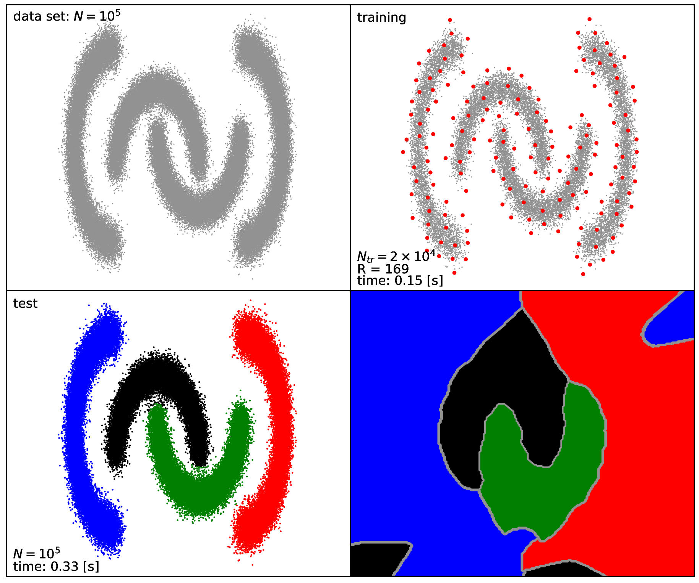

.. _sec_test3:

Test3
=======

This test includes four, 2D clustering problems with different levels of 
nonlinearity regarding the separating hyperplanes, including 
*concentric rings* or the highly non-linear *intertwined spiral* clustering 
problem that are known to be difficult. The whole test is automatic i.e. the 
provided script is responsible for both generating and clustering of the data 
as well as producing some plots summarising the results of the individual 
clustering problems.

Description of the problem
-----------------------------

The provided :ref:`kscICholTest3.py <kscICholTest3_doc>`
:math:`\texttt{Python}` script includes the generation of the data sets and 
execution of the KSC application with the pre-defined input arguments/parameters.
After clustering the data sets, some plots are generated by the script 
to visualise the results of the clustering as well as additional information 
such as the reduced set points used to build the spare KSC model or the 
decision boundaries.

Each of the generated data sets contains four clusters, with 100 000, 2D data 
points with different shapes of the clusters:

 - :math:`\texttt{4Clusters}` : Gaussians clusters with varying sigmas
 - :math:`\texttt{4Moons}`    : intertwined *moon-shaped* clusters
 - :math:`\texttt{4Circles}`  : concentric rings with different thicknesses 
 - :math:`\texttt{4Spirals}`  : intertwined spirals 

The test
---------

The test can be executed as (or adding the :math:`\texttt{-v}` flag as an input 
argument for the full verbosity of the KSC application printouts) ::

  bash-3.2$ python kscICholTest3.py
   ==== (Python) === : clustering the  4Circles  data set ...
   ==== (Python) === : generating decision boundary for the  4Circles  data set ...
   ==== (Python) === : clustering the  4Clusters  data set ...
   ==== (Python) === : generating decision boundary for the  4Clusters  data set ...
   ==== (Python) === : clustering the  4Moons  data set ...
   ==== (Python) === : generating decision boundary for the  4Moons  data set ...
   ==== (Python) === : clustering the  4Spirals  data set ...
   ==== (Python) === : generating decision boundary for the  4Spirals  data set ...

     
This will generate the pre-defined data sets (listed above), perform the clustering 
by executing the :math:`\texttt{KscIchol}\_\texttt{Test}` KSC application with 
the pre-defined input arguments. At the end, a plot for each clustering problem 
is generated containing the input data set, the training data set with the 
selected reduced set points, the clustering results as well as the decision 
boundaries. Intermediate data are 
stored in the :math:`\texttt{output}` directory while the :math`\texttt{res}` 
directory contains the generated figures shown in :numref:`test3_4Clusters`, 
:numref:`test3_4Moons`, :numref:`test3_4Circles` and :numref:`test3_4Spirals`.

   
   Results of clustering the :math:`\texttt{4Clusters}` data set: the whole (
   :math:`N = 100 000`) data set (**top left**), training data set and the 
   reduced set points(red) (**top right**), cluster assignment of the whole data set 
   as the final result (**bottom left**), division of the underlying 2D space by 
   the corresponding KSC model (**bottom right**).

   
   Same as in case of :numref:`test3_4Clusters` but for the :math:`\texttt{4Moons}` data set.

   Same as in case of :numref:`test3_4Clusters` but for the :math:`\texttt{4Circles}` data set.

.. figure::   figs/fig_4Spirals.png
   :scale:    40 %
   :figclass: align-center
   :name:     test3_4Spirals   

   Same as in case of :numref:`test3_4Clusters` but for the :math:`\texttt{4Spirals}` data set.

Note, that training the KSC model and clustering the whole :math:`N = 100 000` 
data sets takes less than a second each (see the note below regarding the 
:math:`\texttt{4Spirals}` problem). 

.. note:: The provided script contains predefined parameters for the 
   :math:`\texttt{KscIchol}\_\texttt{Test}` KSC application(e.g. training data 
   set size, maximum reduced set size, RBF kernel parameters, etc.) for each 
   clustering problem. These parameter values were selected in a conservative 
   way: not only providing good clustering results but also smooth decision 
   boundaries. Therefore, similarly accurate clustering can also be obtained even 
   by using more relaxed KSC application parameters. As an example, the clustering 
   of the :math:`\texttt{4Spirals}` data set, obtained by using the following 
   change in the original input argument :: 
   
     --icholTolError       = 0.6    ---> 0.9
     --icholRBFKernelPar   = 0.0006 ---> 0.0009 
     --clRBFKernelPar      = 0.005  ---> 0.0016

   shown in :numref:`test3_4Spirals_mod`

   .. figure::   figs/fig_4Spirals_mod.png
      :scale:    30 %
      :figclass: align-center
      :name:     test3_4Spirals_mod   

      Same as in case of :numref:`test3_4Spirals` but with the modified input 
      argument of the :math:`\texttt{KscIchol}\_\texttt{Test}` KSC application 
      mentioned above. 
   
   Note, that the number of reduced set size used in the relaxed case drops to 
   318 compared to the original 800 while the quality of the clustering result
   practically not influenced at all (the decision boundaries are less smooth 
   though). 

